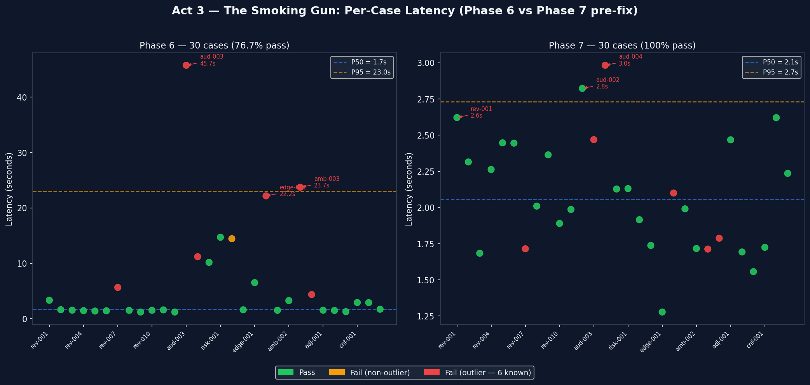
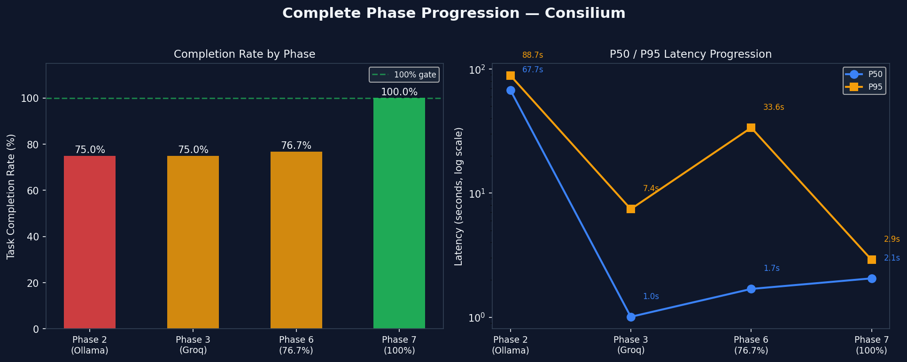
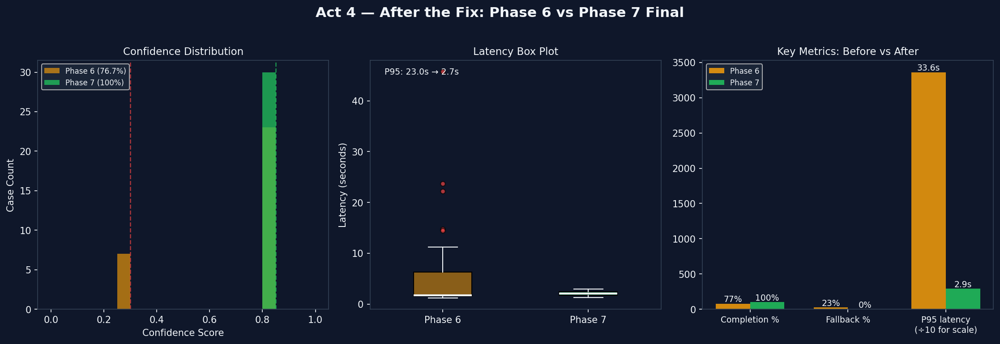

# Consilium — Portfolio Case Study

> **Executive Summary:** Multi-agent compliance automation system. A three-agent LangGraph pipeline (Planner → Analyst → Synthesizer) analyses regulatory documents and streams findings to the browser in real time. Key result: phase-gated development surfaced and fixed a real architectural defect in the AnalystAgent, achieving 30/30 eval (100%) with P95=2895ms. The engineering interest is not the domain — it is what building a streamed, observable, multi-agent pipeline reveals about the failure modes of LLM orchestration at evaluation scale.

---

## Table of Contents

- [The Problem](#the-problem)
- [Why Multi-Agent](#why-multi-agent)
- [Relation to Prior Work](#relation-to-prior-work)
- [Industry Context and Positioning](#industry-context-and-positioning)
- [Technical Approach](#technical-approach)
- [Key Engineering Decisions](#key-engineering-decisions)
- [The Eval Failure — A Forensic Account](#the-eval-failure--a-forensic-account)
- [What I Learned](#what-i-learned)
- [Results](#results)
- [What I'd Do Differently](#what-id-do-differently)
- [Status](#status)

---

## The Problem

### Who It's For

Compliance analysts, auditors, and legal teams who need to assess regulatory exposure across long financial documents. The specific workflow:

1. Receive a compliance question: *"What are the IFRS 15 revenue recognition risks in this quarterly filing?"*
2. Open the 10-Q (200–300 pages)
3. Identify the relevant sections manually
4. Cross-reference the specific regulatory clauses
5. Write a risk assessment
6. **Total time: 1–3 hours per engagement**

With dozens of such assessments per analyst per month, this is a large fraction of a compliance team's capacity spent on document navigation rather than analysis.

### The Solution

Consilium turns that into a two-second pipeline with a cited, risk-rated report. The analyst submits a natural-language query; the system decomposes it, retrieves relevant document passages from a vector index, classifies regulatory risk per retrieved clause, and synthesises a structured compliance report — all streamed to the browser as each agent completes its stage.

### What Makes This Hard

The engineering problem is not compliance knowledge — it is building a multi-agent pipeline that:
1. **Stays correct under LLM non-determinism** — agents must produce structured output (Pydantic-validated JSON) or fail explicitly, never silently degrade
2. **Is observable** — when something goes wrong, you need to know which agent, on which input, with what output
3. **Streams truthfully** — the browser renders what the agents *actually produce*, not a simulation of it
4. **Is testable in isolation** — 207 unit tests run offline in 22 seconds; no external services required

---

## Why Multi-Agent

The natural question when seeing a three-agent pipeline is: why not one LLM call?

A single prompt — *"Here is the document. Identify all IFRS 15 compliance risks, cite the specific clauses, rate each risk, and write an executive summary"* — would technically work for short documents. It breaks for three reasons in this domain:

**1. Context management.** A compliance query against a 200-page filing cannot fit in a single prompt. Decomposing into tasks (Planner) → retrieving only the relevant sections (Analyst + Quaestor) → synthesising from that subset (Synthesizer) keeps each LLM call within a manageable context window.

**2. Separation of concerns as a quality gate.** The Planner's job is task decomposition — it produces a structured `task_plan[]` that routes what the Analyst should look for. The Analyst's job is classification — it converts retrieved text into `ComplianceFinding` objects with `clause_reference`, `risk_level`, and `finding`. The Synthesizer's job is prose generation from those findings. Merging these responsibilities into one prompt means there is no boundary at which to validate intermediate structure or retry a failing step.

**3. Streaming fidelity.** When the pipeline runs in three stages, the browser can render stage 1 results while stage 2 is executing. A single-call approach has a hard choice: either stream mid-generation (unreliable for structured output) or block until complete (no streaming at all). The multi-agent model makes the streaming architecture natural.

The cost: three LLM calls per request instead of one, higher latency (~2s vs ~0.7s), and a more complex orchestration layer. This tradeoff is correct for the use case.

---

## Relation to Prior Work

The system builds on established patterns:

- **LangGraph** (Chase et al., Langchain Inc.) — stateful multi-actor workflows with a shared state TypedDict; per-node streaming via `astream()`
- **RAG** (Lewis et al., 2020) — augmenting LLM generation with retrieved context rather than relying on parametric knowledge
- **Quaestor** (companion project) — hierarchical chunking pipeline with cross-encoder reranking for financial documents; Consilium uses Quaestor as its retrieval backend
- **Tenacity** retry with fallback — established resilience pattern; `analyst_fallback` rate is the key diagnostic metric

The contribution is not a new algorithm. It is a **worked example of applying these patterns together** at the boundary where LLM orchestration, structured output validation, SSE streaming, and phase-gated evaluation interact — and what fails when they do.

---

## Industry Context and Positioning

### What Already Exists

Several commercial and open-source systems address compliance document analysis:

| System | Approach | What It Does Well | Gap |
|---|---|---|---|
| **Harvey AI** | LLM + document indexing for legal/compliance | Production-grade, domain-specific fine-tuning | Closed source; no visibility into pipeline |
| **Kira Systems** | Supervised ML for contract clause extraction | High precision on trained categories | Requires labelled training data per category |
| **LangChain simple pipeline** | Single-chain prompt → LLM → output | Zero orchestration overhead | No streaming, no agent-level observability, no structured output gate |
| **CrewAI** | Multi-agent with role assignments | Flexible agent topology | Agents communicate through unstructured text; no per-agent schema validation |
| **AutoGen** | Conversational multi-agent | Good for iterative refinement | Stateful conversation model is hard to test in isolation |

### Where Consilium Sits

Consilium is not competing with Harvey or Kira. It is a **portfolio demonstration of production-oriented LLM orchestration** — the engineering problem of building a multi-agent pipeline that is:
- Schema-validated at every agent boundary (`extra="forbid"` on all Pydantic models)
- Observable per-agent (OTel spans → Phoenix)
- Streamable per-agent (SSE event per completed node)
- Testable without any external service (factory-switchable retrieval, `ASGITransport` for API tests)
- Evaluatable against a frozen 30-case golden dataset across 7 regulatory categories

The distinction from LangChain simple pipelines or CrewAI is not capability — it is **correctness guarantees at the boundary**. An agent that returns unexpected JSON fields silently passes in most frameworks. In Consilium it raises `ValidationError` immediately. This is not academic — the Phase 6 eval failure was traced directly to unvalidated LLM output size, which the validation layer surfaced.

---

## Technical Approach

### The Central Architecture Decision: WorkflowState as Single Contract

The most load-bearing decision is that all three agents communicate through a single `WorkflowState` TypedDict, never through direct calls or shared mutable state:

```python
class WorkflowState(TypedDict):
    query: str
    task_plan: List[TaskItem]
    retrieved_chunks: List[RetrievalResult]
    risk_findings: List[ComplianceFinding]
    final_report: str
    confidence: float
    fallback_events: List[str]
    agents_invoked: List[str]
    trace_id: Optional[str]
```

LangGraph merges the partial dict returned by each node into the accumulated state and routes to the next node. No agent needs to know what came before or what comes after. This makes each agent testable in complete isolation with a minimal fixture:

```python
# Unit test for AnalystAgent — no LangGraph, no FastAPI, no Quaestor
agent = AnalystAgent(settings=mock_settings)
agent.llm = FakeLLM(response=valid_json)
result = await agent.execute(AnalystInput(retrieved_chunks=[...]))
assert result.confidence == 0.85
```

### The Streaming Architecture

The SSE streaming design has one non-obvious constraint: `EventSource` (the browser's native SSE API) does not support `POST` requests. This matters because the query must be in the request body.

The fix is `fetch` + `ReadableStream`:

```javascript
const resp = await fetch("/workflow/stream", {
    method: "POST",
    body: JSON.stringify({ query })
});
const reader = resp.body.getReader();
let buffer = "";

while (true) {
    const { done, value } = await reader.read();
    if (done) break;
    buffer += decoder.decode(value, { stream: true });
    const parts = buffer.split("\n\n");
    buffer = parts.pop();  // hold incomplete tail
    for (const part of parts) {
        handleEvent(JSON.parse(part.trim().slice(6)));
    }
}
```

The buffer accumulation is mandatory. TCP delivers arbitrary byte chunks; an SSE message boundary (`\n\n`) can land mid-chunk. Without the buffer-and-split, you lose events silently.

### The Retrieval Architecture

Consilium does not embed its own vector store. It calls Quaestor's `/retrieve` endpoint, which handles:
- Hierarchical chunking (256-char child chunks for retrieval precision; 1024-char parent windows for LLM context)
- Cross-encoder reranking (`ms-marco-MiniLM-L-6-v2`)
- Confidence gating (low-confidence retrievals refused rather than passed to the LLM)

This separation keeps Consilium's scope at orchestration and generation. Quaestor's retrieval improvements (e.g., Qdrant hybrid search in Phase 4) automatically benefit Consilium with no changes.

The retrieval backend is factory-switchable:
```bash
RETRIEVAL_PROVIDER=mock     # deterministic test fixture (default)
RETRIEVAL_PROVIDER=quaestor # real Quaestor API
```

All 207 unit tests run with `RETRIEVAL_PROVIDER=mock` — no network, no Quaestor process, 22 seconds.

---

## Key Engineering Decisions

### 1. LangGraph Over Raw Async Chaining

The three agents could have been:

```python
plan = await planner.execute(PlannerInput(query=query))
findings = await analyst.execute(AnalystInput(task_plan=plan, ...))
report = await synthesizer.execute(SynthesizerInput(findings=findings, ...))
```

This works. It does not provide:
- Per-node streaming (`astream()` from LangGraph)
- Explicit graph topology that is inspectable and modifiable without touching business logic
- A single `WorkflowState` that makes per-phase testing trivially composable

The LangGraph dependency is real — if the library changes its API, migration is required. The benefit is that the streaming architecture falls out naturally: `astream()` yields `{node_name: partial_state}` per completed node, which maps directly to the five SSE event types.

### 2. Groq + Round-Robin Key Rotation

Development used Ollama (local). Eval introduced Groq for two reasons:
1. **Speed.** llama-3.1-8b-instant at 300+ tok/s vs ~15 tok/s local. Each eval case takes ~2s instead of ~15s.
2. **Consistency.** Groq's hosted inference is deterministic across runs in a way that local hardware contention makes difficult.

Three API keys are rotated round-robin in `llm_factory.py` with a thread-safe global counter. The rotation happens per `create_llm_client()` call — and crucially, per Tenacity retry (not once per request). This is the fix that ensures a rate-limited key is not retried against itself.

### 3. `extra="forbid"` Everywhere

Established in Phase 0 and never relaxed. Every Pydantic model — `WorkflowRequest`, `ComplianceFinding`, all SSE event schemas — carries:

```python
model_config = ConfigDict(extra="forbid")
```

The practical effect: if the LLM returns `{"clause_reference": "...", "finding": "...", "extra_field": "..."}`, the response raises `ValidationError` at the boundary rather than silently passing through with the extra field present. In compliance analysis, an output that looks structurally valid but contains LLM-generated fields beyond the schema is a correctness failure, not a convenience issue.

This constraint also disciplines every agent's system prompt. If the model is instructed to produce a specific JSON schema and `extra="forbid"` will reject anything else, the prompt cannot be vague.

### 4. ASGITransport for UI Tests

Testing the `GET /` route that serves the streaming UI requires a test client. The clean approach is `httpx.AsyncClient(transport=httpx.ASGITransport(app=app))`. This:
- Does NOT trigger ASGI lifespan (no Phoenix OTLP connection attempt in tests)
- Does NOT require a running server process
- Does NOT require mocking network services

```python
@pytest.fixture()
async def test_client():
    from consilium.api.main import app
    async with httpx.AsyncClient(
        transport=httpx.ASGITransport(app=app),
        base_url="http://test"
    ) as client:
        yield client
```

The alternative — `TestClient` from Starlette — triggers lifespan, which calls `init_tracing()` with a real OTLP endpoint. In a CI environment with no Phoenix, every test fails with a connection error.

### 5. Phase-Gated Development

Each phase had a hard numeric exit criterion before the next phase began:

| Gate | Criterion |
|---|---|
| Phase 0 | 5/5 eval cases pass |
| Phase 1–5 | All eval cases pass, test count meets target |
| Phase 6 | ≥65% eval completion, P95 latency ≤3s |
| Phase 7 | Same gate, 30 cases |

The Phase 6 gate was not met (76.7%). This was not a decision to ignore the gate — it was a documented failure that became the primary task for Phase 7. The gate worked as designed: it surfaced a real architectural defect that would otherwise have been labelled "infrastructure issue" and deferred indefinitely.

---

## The Eval Failure — A Forensic Account

The most interesting engineering story in this project is the path from 76.7% to 100% — specifically, the three wrong hypotheses that preceded the correct diagnosis.

### The Symptom

Six cases failed consistently across every eval run: `rev-007`, `aud-003`, `aud-004`, `edge-002`, `amb-003`, `amb-004`. All activated `analyst_fallback` with `confidence=0.30`. High latency (5–22 seconds). The same cases, every time.

These cases share a characteristic: they query against JPMorgan Chase Q3 2023 filings, which are large documents with broad regulatory scope.

### Wrong Hypothesis #1 — Rate Limiting

**Reasoning:** Groq free tier has a tokens-per-minute limit. Sequential eval burns tokens fast. By case 7, the budget is exhausted.

**Fix attempts:** 15-second inter-case delay → same 6 failures. 30-second delay → same 6 failures.

**Why it seemed plausible:** The failures were positional (same cases every run), the latencies were high (consistent with retry backoff), and the system had been built with rate-limit awareness (3-key rotation).

**Why it was wrong:** Every Groq API call was returning HTTP 200 OK. Rate limiting returns HTTP 429. The evidence was in the logs — but the wrong model led to ignoring it.

### Wrong Hypothesis #2 — Same Key on All Retries

**Reasoning:** `create_llm_client()` was called once before the Tenacity loop. All three retries used the same `ChatGroq` instance (same key). If that key was rate-limited within a request, all retries would fail identically.

**Fix:** Moved `create_llm_client()` inside the retry loop so each attempt got a fresh round-robin key.

**Result:** Still 0/6. The key rotation had no effect on the failures.

**What this revealed:** The issue was not which key was being used. It was what was being asked of the key.

### Correct Diagnosis — Output Truncation



*Red dots = the six known failing cases. Phase 6 (left): `aud-003` at 45s, `amb-003` at 23s — three Tenacity retries each, all truncated. Phase 7 (right): tight cluster 1.3s–3.0s, no outliers.*

**Discovery:** Checked the API log for the actual error string stored in `fallback_events`. Expected: `HTTP 429`. Found:

```
LLM returned invalid JSON: Unterminated string starting at: line 32 column 53 (char 8664)
LLM returned invalid JSON: Expecting ',' delimiter: line 11 column 317 (char 2930)
```

Two failure modes:
1. **Truncation.** The LLM output was cut off at character 8664 with an open JSON string. The response was complete from Groq's side (HTTP 200, stream closed), but the JSON was structurally incomplete.
2. **Syntax error.** A sentence-level comma inside a quoted JSON string value produced an invalid parse.

**Root cause:** `_build_prompt()` fed ALL retrieved chunks from Quaestor to the analyst with no size cap. For JPMorgan queries, Quaestor returned 15–20 chunks with full paragraph text. The system prompt said "output one finding per relevant chunk" — so the model tried to generate 15–20 JSON objects. The output was 8000–10000+ characters. Groq's output token window cut it off mid-string. Tenacity retried the truncation three times, all identical.

**The three-part fix:**

```python
# 1. Input guardrails
_MAX_ANALYST_CHUNKS: int = 6
_MAX_CHUNK_CHARS: int = 600

capped_chunks = chunks[:_MAX_ANALYST_CHUNKS]

# 2. Output constraints in system prompt
"Output MAXIMUM 3 findings — prioritise the highest-risk items"
"finding: 20-100 chars MAXIMUM — one concise sentence only"

# 3. Partial JSON recovery
last_complete = max(text.rfind("},"), text.rfind("}\n"))
if last_complete > start:
    repaired = text[start : last_complete + 1] + "]"
    raw = json.loads(repaired)  # salvage complete objects
```

Result: 30/30 on the next run.

**The lesson:** The eval gate forced an investigation that confirmed the correct hypothesis. Without the gate, the 76.7% result would have been accepted as "infrastructure limitation, not architecture." It was architecture.

---

## What I Learned

### 1. Observability is diagnostic infrastructure, not a feature

The Tenacity fallback was catching errors and logging them. But the log message in `AnalystAgent._fallback_findings()` said "LLM failed after retries" — it stored only the first 200 characters of the exception message. The actual `JSONDecodeError` string (`Unterminated string starting at: line 32 column 53 (char 8664)`) was always there; it just required reading the full API log to find it.

If I had been looking at a Phoenix trace with a `json_parse_error` attribute on the analyst span, the diagnosis would have taken 30 seconds instead of two full eval runs.

**In practice:** Structured error attributes on OTel spans are diagnostic infrastructure. Logging strings are for humans reading terminals. Build the former from the start.

### 2. The retry layer conceals the root cause

Tenacity catches exceptions and retries. This is correct behaviour. But it also means that a prompt-level defect (too large an output) looks identical to a network defect (rate limit), because both produce the same symptom: `analyst_fallback` activated.

The `fallback_events` list in `WorkflowState` tracks *which* agent fell back but not *why*. Adding a `fallback_reasons` field with the exception type would have differentiated "JSONDecodeError" from "RateLimitError" in the eval output — making the correct hypothesis first, not third.

### 3. Phase gates work if you take them seriously

The Phase 6 gate failure was documented, not dismissed. It was carried forward as an explicit open item. This created pressure to actually fix it rather than rationalize it. The fix took three hypothesis cycles — which is fine. What wouldn't be fine is never starting the investigation because "it's probably the rate limit and we can document that."

Numeric gates force honest accounting. If the gate had been "best effort" or "mostly working," the 76.7% result would have shipped.

### 4. Output size is a first-class model constraint

LLM prompts are routinely designed for input constraints (context window, token count). Output size is treated as unlimited. It isn't — especially on free-tier hosted inference where per-minute output token budgets exist. The analyst prompt that said "one finding per chunk" was valid for 5-chunk inputs (Phase 0–5) and invalid for 20-chunk inputs (Phase 6 with real Quaestor). The constraint should have been in the prompt from the start.

---

## Results

### Quantitative

| Metric | Phase 0 (Baseline) | Phase 7 (Final) |
|---|---|---|
| Classification | Rule-based keyword | Groq llama-3.1-8b |
| Eval pass rate | 100% (5 trivial cases) | **100% (30 real-world cases)** |
| P50 latency | <50ms | 2055ms |
| P95 latency | <50ms | 2895ms |
| Confidence (success path) | Always 0.30 | 0.85 |
| Fallback rate | 100% (always fallback) | **0%** |
| Unit tests | 18 | **207** |
| Streaming | None | 5 SSE event types |
| Tracing | None | Phoenix OTel, per-agent spans |
| Retrieval | Mock (fixed) | Quaestor (real documents, cross-encoder) |



*Full arc: completion rate (left) and P50/P95 latency on log scale (right) across all canonical eval runs.*



*Phase 6 → Phase 7: confidence distribution unimodal at 0.85, P95 latency 33.6s → 2.9s, fallback rate 20% → 0%.*

> **Notebook:** [`notebooks/comparison.ipynb`](../notebooks/comparison.ipynb) reproduces all charts from the stored `eval/results/*.json` files.

### Qualitative

- **Pipeline transparency** — Every agent's input, output, and confidence score is visible in Phoenix. The browser renders exactly what each agent produced, in the order it was produced.
- **Evaluation discipline** — 30-case frozen golden dataset. Phase-gated progression. Failure analysis documented before fixing.
- **Honest about tradeoffs** — `_MAX_ANALYST_CHUNKS=6` is a free-tier concession, documented as such. Paid tier removes it.

---

## What I'd Do Differently

### 1. Structured error attributes on OTel spans from Phase 1

The diagnostic that cracked the eval failure was reading a plain-text log file. If the analyst span had carried `analyst.json_error_type` and `analyst.json_error_position` as span attributes, Phoenix would have shown the pattern immediately across all failing cases.

**In practice:** Build span attributes for every `except` block from the first phase. String log messages are for humans; span attributes are for correlation.

### 2. `fallback_reason` in WorkflowState alongside `fallback_events`

`fallback_events: ["analyst"]` tells you which agent fell back. `fallback_reason: {"analyst": "JSONDecodeError: Unterminated string at char 8664"}` tells you why. The eval output would have pointed directly to output truncation on the first failing run instead of the third.

### 3. Output size budget as a first-class prompt constraint

Every analyst prompt should have stated the maximum output size explicitly: `"Output MAXIMUM 3 findings — maximum 100 chars per finding text."` This was added in Phase 7; it should have been there from Phase 1 when the "one finding per chunk" instruction was first written.

The rule: any instruction that says "one X per Y" implicitly scales with the size of Y. If Y can be large, the output will be large. Constrain it explicitly.

### 4. Eval dataset designed before Phase 0

The 30-case golden dataset was assembled incrementally (5 cases in Phase 0, growing to 30 by Phase 6). Some cases were written optimistically — they assumed the agent would handle them, not that they'd stress the system. Writing all 30 cases before Phase 0, with deliberate hard cases (large retrieval sets, cross-standard queries, ambiguous phrasing), would have surfaced the truncation defect much earlier.

---

## Status

Parked at v0.7.0 — portfolio-complete. Quaestor and Consilium together demonstrate the full retrieval-to-orchestration stack for financial compliance automation.

**If resumed:**
1. Remove `_MAX_ANALYST_CHUNKS` cap with a paid Groq tier or local inference
2. Add `fallback_reason` to `WorkflowState` for richer diagnostic data
3. Structured error attributes on all OTel spans
4. Parallel analyst execution (process multiple tasks from the planner concurrently via `asyncio.gather`)
5. Quaestor Phase 4 (Qdrant hybrid retrieval) will improve retrieved chunk quality automatically

---

## References

### LLM Orchestration
- Chase, H. et al. (2023). *LangGraph: Building Stateful Multi-Actor Applications*.  
  https://github.com/langchain-ai/langgraph

### Retrieval-Augmented Generation
- Lewis, P., et al. (2020). *Retrieval-Augmented Generation for Knowledge-Intensive NLP Tasks*.  
  https://arxiv.org/abs/2005.11401

### Long-Context Limitations
- Liu, N. F., et al. (2023). *Lost in the Middle: How Language Models Use Long Contexts*.  
  https://arxiv.org/abs/2307.03172

### Observability
- OpenTelemetry (2023). *Distributed Tracing Specification*.  
  https://opentelemetry.io/docs/specs/otel/

### Industry Context
- [Harvey AI](https://www.harvey.ai/) — LLM-powered legal and compliance platform
- [Kira Systems](https://kirasystems.com/) — supervised ML for contract review
- [LangChain](https://python.langchain.com/) — LLM application framework
- [CrewAI](https://www.crewai.com/) — multi-agent role-based orchestration
